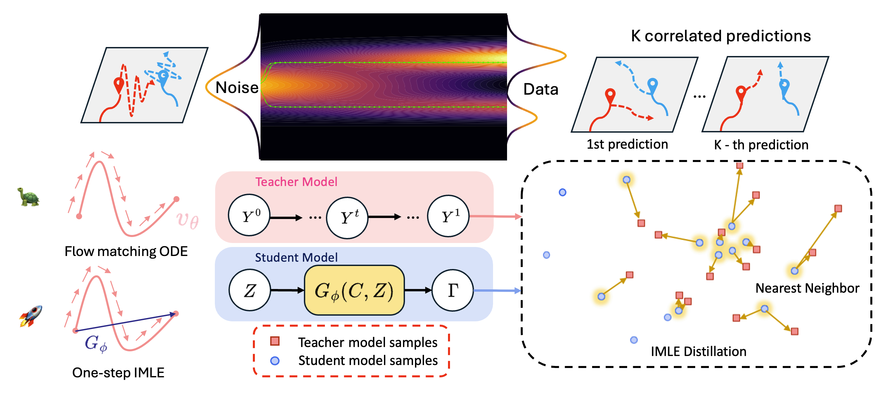
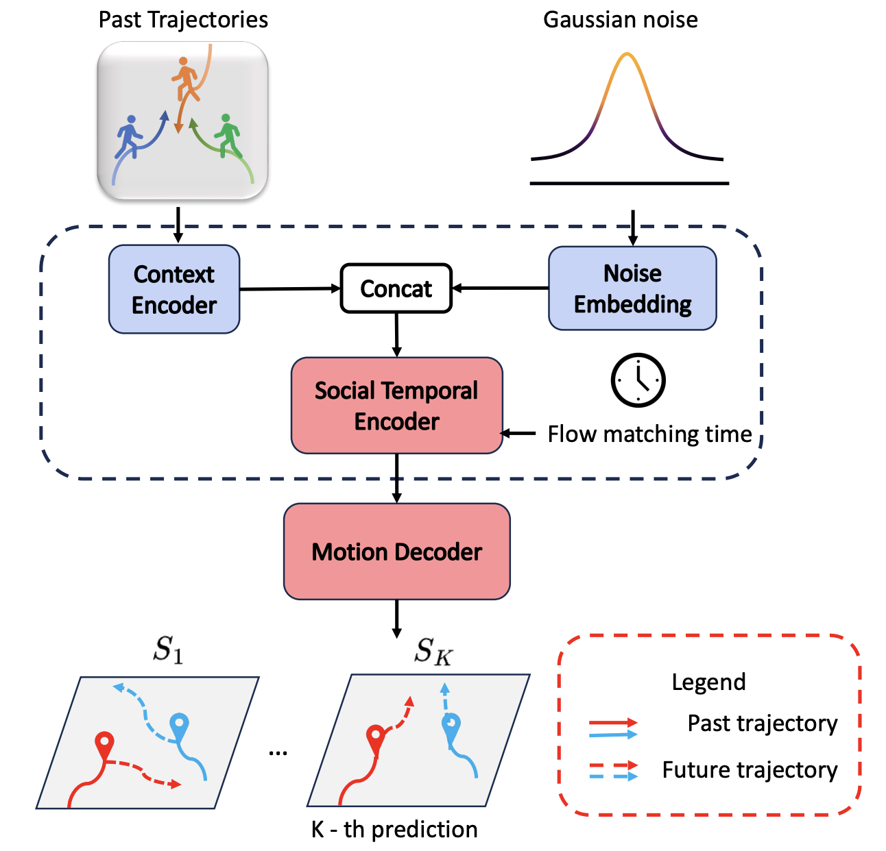

# MoFlow-IMLE
[](https://arxiv.org/abs/2503.09950)
[](https://moflow-imle.github.io/)

The **official** PyTorch implementation of CVPR'25 paper named "MoFlow: One-Step Flow Matching for Human Trajectory Forecasting via Implicit Maximum Likelihood Estimation Distillation"


## 📢 News
- [2024/02] 🎉 Paper accepted to CVPR 2025!
- [2024/03] 🚀 Code repository is now public
- [2024/03] 📊 Preprocessed datasets are available in the `./data/[datasets]` folder
- [2024/03] 🔥 Model checkpoints and samples from MoFlow coming soon

## 📝 Overview



Human trajectory forecasting is a challenging task that involves two key objectives:
1. Predicting future trajectories with high precision.
2. Generating diverse future movements that capture the inherent uncertainty in human decision-making.

We address this challenge by introducing MoFlow, a novel Motion prediction conditional Flow matching model that generates K-shot future trajectories for all agents in a given scene. Our key contributions include:

- A novel flow matching loss function that ensures both accuracy and diversity in trajectory predictions
- An innovative distillation method for flow models using Implicit Maximum Likelihood Estimation (IMLE)
- A one-step flow matching approach that significantly reduces computational complexity

Our MoFlow can generate diverse trajectories that are physically and socially plausible. Moreover, our one-step student model IMLE is **100** times faster than the teacher flow model during sampling!

## 🛠️ Environment Setup

```bash
# Create a new conda environment
conda create -n moflow python=3.8
conda activate moflow

# Install PyTorch (adjust version based on your CUDA version)
conda install pytorch torchvision torchaudio pytorch-cuda=11.8 -c pytorch -c nvidia

# Install other dependencies
pip install -r requirements.txt
```

## 📊 Datasets

This project supports three major trajectory datasets:

### 1. NBA SportVU Dataset
- **Description**: High-resolution basketball player trajectories from NBA games
- **Contents**: Detailed player positions and movement data
- **Location**: Preprocessed data available in `data/nba/`
- **Source**: Compatible with datasets used in [LED](https://github.com/MediaBrain-SJTU/LED) and [GroupNet](https://github.com/MediaBrain-SJTU/GroupNet)
- We select the first 32500 scenes from the training data and 12500 scenes from the test data. The original datasets can be found in this [Google Drive](https://drive.google.com/drive/folders/1Uy8-WvlCp7n3zJKiEX0uONlEcx2u3Nnx)

### 2. ETH-UCY Dataset
- **Description**: Pedestrian trajectories across 5 diverse scenes (ETH, Hotel, Univ, Zara1, and Zara2)
- **Location**: Preprocessed data available in `data/eth_ucy/`
- **Sources**:
  - Based on the original ETH-UCY dataset used in [SocialGAN](https://github.com/agrimgupta92/sgan)
  - Dataset files courtesy of [EigenTrajectory](https://github.com/InhwanBae/EigenTrajectory)
- **Setup**: Execute the download script in `data/eth-ucy/` to obtain the dataset. Run `./data/eth_ucy/download_eth_ucy_dataset.sh`. This is the same script from [EigenTrajectory](https://github.com/InhwanBae/EigenTrajectory). 
- **Note**: This version differs from the one used in LED

### 3. Stanford Drone Dataset (SDD)
- **Description**: Diverse trajectory data from a university campus environment
- **Contents**: Multi-agent trajectories including pedestrians, cyclists, and vehicles
- **Location**: Preprocessed data available in `data/sdd/`
- **Versions**:
  - Primary version sourced from [TUTR](https://github.com/lssiair/TUTR)
  - Additional experiments conducted using [NSP](https://github.com/realcrane/Human-Trajectory-Prediction-via-Neural-Social-Physics) version

## 🚀 Usage


Our teacher MoFlow model and student IMLE model share almost the same architecture. However, the student IMLE model does not require time conditioning, eliminating the neural network component that processes it. We can load the weights from our pre-trained teacher model via `--load_pretrained` to accelerate the training further.

### 🎯 Training and Evaluation Pipeline

For each dataset, we need to train our MoFlow teacher model first:

1. **Teacher Model Training**
```bash
### NBA dataset
python fm_nba.py --exp <exp_name> --tied_noise --fm_in_scaling --checkpt_freq 5 --batch_size 192 --init_lr 1e-3

### ETH dataset
python3 fm_eth.py --exp <exp_name> --rotate --data_source LED --rotate_time_frame 6 --subset eth --tied_noise --fm_in_scaling --checkpt_freq 1 --batch_size 32 --init_lr 1e-4 
python3 fm_eth.py --exp <exp_name> --rotate --data_source LED --rotate_time_frame 6 --subset hotel --tied_noise --fm_in_scaling --checkpt_freq 1 --batch_size 48 --init_lr 1e-4 
python3 fm_eth.py --exp <exp_name> --rotate --data_source LED --rotate_time_frame 6 --subset univ --tied_noise --fm_in_scaling --checkpt_freq 1 --batch_size 48 --init_lr 1e-4 
python3 fm_eth.py --exp <exp_name> --rotate --data_source LED --rotate_time_frame 6 --subset zara1 --tied_noise --fm_in_scaling --checkpt_freq 1 --batch_size 32 --init_lr 1e-4 
python3 fm_eth.py --exp <exp_name> --rotate --data_source LED --rotate_time_frame 6 --subset zara2 --tied_noise --fm_in_scaling --checkpt_freq 1 --batch_size 32 --init_lr 1e-4 

### SDD dataset
python fm_sdd.py --exp <exp_name> --rotate --rotate_time_frame 6 --tied_noise --fm_in_scaling --checkpt_freq 1 --batch_size 48 --init_lr 1e-4 --perturb_ctx 0.03
```

2. **Teacher Model Sampling**
```bash
### NBA dataset
python3 eval_nba.py --ckpt_path <path_to_nba_teacher_checkpoint> \
--batch_size 1000 --sampling_steps 100 --solver lin_poly --lin_poly_p 5 --lin_poly_long_step 1000 --save_samples --eval_on_train

### ETH dataset
python3 eval_eth.py \
--ckpt_path <path_to_eth_teacher_checkpoint> \
--subset eth --rotate --rotate_time_frame 6 \
--batch_size 1000 --sampling_steps 100 --solver lin_poly --lin_poly_p 5 --lin_poly_long_step 1000 --save_samples --eval_on_train

python3 eval_eth.py \
--ckpt_path <path_to_hotel_teacher_checkpoint> \
--subset hotel --rotate --rotate_time_frame 6 \
--batch_size 1000 --sampling_steps 100 --solver lin_poly --lin_poly_p 5 --lin_poly_long_step 1000 --save_samples --eval_on_train

python3 eval_eth.py \
--ckpt_path <path_to_univ_teacher_checkpoint> \
--subset univ --rotate --rotate_time_frame 6 \
--batch_size 1000 --sampling_steps 100 --solver lin_poly --lin_poly_p 5 --lin_poly_long_step 1000 --save_samples --eval_on_train

python3 eval_eth.py \
--ckpt_path <path_to_zara1_teacher_checkpoint> \
--subset zara1 --rotate --rotate_time_frame 6 \
--batch_size 1000 --sampling_steps 100 --solver lin_poly --lin_poly_p 5 --lin_poly_long_step 1000 --save_samples --eval_on_train

python3 eval_eth.py \
--ckpt_path <path_to_zara2_teacher_checkpoint> \
--subset zara2 --rotate --rotate_time_frame 6 \
--batch_size 1000 --sampling_steps 100 --solver lin_poly --lin_poly_p 5 --lin_poly_long_step 1000 --save_samples --eval_on_train

### SDD dataset
python eval_sdd.py --ckpt_path <path_to_sdd_teacher_checkpoint> \
--rotate --rotate_time_frame 6 --batch_size 1000 --sampling_steps 100 --solver lin_poly --lin_poly_p 5 --lin_poly_long_step 1000 --save_samples --eval_on_train
```


Let's train our IMLE student model now.

3. **Student Model Training**
```bash
### NBA dataset
python3 imle_nba.py --exp <exp_name> \
--checkpt_freq 1 --epochs 50 --batch_size 48 --init_lr 1e-3 --num_to_gen 20 \
--load_pretrained --ckpt_path <path_to_nba_teacher_checkpoint>

### ETH dataset
python3 imle_eth.py --exp <exp_name> \
--checkpt_freq 1 --epochs 50 --batch_size 24 --init_lr 1e-4 --num_to_gen 20 \
--subset eth --rotate --rotate_time_frame 6 \
--load_pretrained --ckpt_path <path_to_eth_teacher_checkpoint>

python3 imle_eth.py --exp <exp_name> \
--checkpt_freq 1 --epochs 50 --batch_size 16 --init_lr 1e-4 --num_to_gen 20 \
--subset hotel --rotate --rotate_time_frame 6 \
--load_pretrained --ckpt_path <path_to_hotel_teacher_checkpoint>

python3 imle_eth.py --exp <exp_name> \
--checkpt_freq 1 --epochs 50 --batch_size 32 --init_lr 1e-4 --num_to_gen 20 \
--subset univ --rotate --rotate_time_frame 6 \
--load_pretrained --ckpt_path <path_to_univ_teacher_checkpoint>

python3 imle_eth.py --exp <exp_name> \
--checkpt_freq 1 --epochs 50 --batch_size 64 --init_lr 1e-4 --num_to_gen 20 \
--subset zara1 --rotate --rotate_time_frame 6 \
--load_pretrained --ckpt_path <path_to_zara1_teacher_checkpoint>

python3 imle_eth.py --exp <exp_name> \
--checkpt_freq 1 --epochs 50 --batch_size 48 --init_lr 1e-4 --num_to_gen 20 \
--subset zara2 --rotate --rotate_time_frame 6 \
--load_pretrained --ckpt_path <path_to_zara2_teacher_checkpoint>

### SDD dataset
python3 imle_sdd.py --exp <exp_name> --rotate --rotate_time_frame 6 \
--checkpt_freq 1 --epochs 50 --batch_size 48 --init_lr 1e-4 --num_to_gen 20 \
--load_pretrained --ckpt_path <path_to_sdd_teacher_checkpoint>
```

### Suggestions
We recommend running `python -h *.py` to explore how configuration files are read from the `./cfg/` directory and the usage of other arguments. Once familiar, you can create your own custom config files.

## ✅ Checklist for Code Upload
- [x] ~~Datasets including NBA SportVU, SDD and ETH-UCY datasets~~
- [ ] Project structure
- [x] ~~Training scripts~~
- [x] ~~Evaulation scripts~~
- [x] ~~Environment setup & config files~~
- [ ] Model Checkpoints

## 📚 Citation
If you find our code useful, please consider cite our paper:
```
@inproceedings{fu2025moflowonestepflowmatching,
  author    = {Fu, Yuxiang and Yan, Qi and Wang, Lele and Li, Ke and Liao, Renjie},
  title     = {MoFlow: One-Step Flow Matching for Human Trajectory Forecasting via Implicit Maximum Likelihood Estimation based Distillation},
  journal   = {Proceedings of the IEEE/CVF Conference on Computer Vision and Pattern Recognition},
  year      = {2025},
}
```

## 🙏 Acknowledgements

This codebase is built on [LED](https://github.com/MediaBrain-SJTU/LED) and [MTR](https://github.com/sshaoshuai/MTR). We thank the authors and appreciate the efforts for releasing their code. We also acknowledge the repos from [Datasets](#-datasets) section where they released the data and dataloader.

## ⭐ Star History

[](https://star-history.com/#felix-yuxiang/MoFlow&Timeline)
